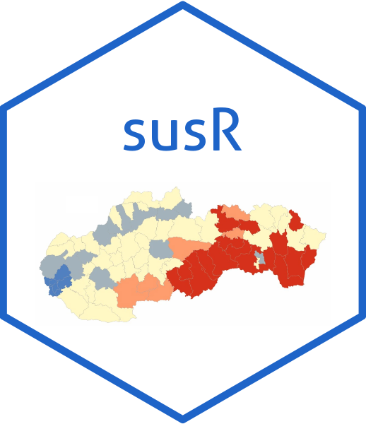

<!-- README.md is generated from README.Rmd. Please edit that file -->

# susR

<!-- badges: start -->
<!-- badges: end -->



susR is an R package providing a convenient interface to the Slovak
Statistical Office (SUSR) open data API. It simplifies tasks such as:

- Listing available tables.
- Retrieving dimension codes and values for a selected table(s).
- Fetching the data itself in a straightforward manner.
- Returning user-friendly tibbles ready for analysis.

This allows you to explore official Slovak statistical data directly
within R, ensuring a reproducible and efficient workflow.

## Installation

You can install the development version of susR from
[GitHub](https://github.com/) with:

``` r
devtools::install_github("Arnold-Kakas/susR")
```

## Example

This is a basic example illustrating how you might use susR to list
available tables and fetch dimension values for a specific one.

``` r


library(susR)

# 1) Retrieve a list of all available tables
tables <- susr_tables()

head(tables)
#> # A tibble: ... 
#> #   class   href                                            table_code ...
#> #   <chr>   <chr>                                           <chr>      ...
#> #   ...

# 2) Suppose we want the dimension values for the first table's first dimension:
#    We'll pick a table code and a dimension code from the table info

table_code <- tables$table_code[1]
# E.g., "as1001rs" or something similar
dimension_code <- "as1001rs_rok" # Hypothetical dimension code

dim_values <- susr_dimension_values(table_code, dimension_code)

head(dim_values)
#> # A tibble: ...
#> #   dimension_code  dimension_label dimension_note element_index element_value element_label
#> #   ...
```

For more details on additional functions, usage examples, and how to
retrieve the actual data, check out the package documentation and [view
the vignette](./doc/getting_started.html).

For bugs or feature requests, please open an issue on the GitHub repo.

Happy analyzing with susR!
